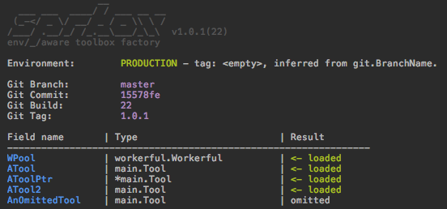

# SpareBox 

[](https://github.com/oblq/sprbox)
[](https://travis-ci.org/oblq/sprbox)
[](https://codecov.io/gh/oblq/sprbox)
[](https://goreportcard.com/report/github.com/oblq/sprbox)

[](https://godoc.org/github.com/oblq/sprbox)
[](https://lbesson.mit-license.org/)


**SpareBox** is a toolbox factory with automatic package configuration based on your build environment.

## Installation

```sh
go get -u github.com/oblq/sprbox
```

## Getting Started

1. In your project, create a config path with a subfolder for every environment you plan to use:  
    ```
    ├── config
    │   ├── development
    │   ├── local
    │   ├── production
    │   ├── staging
    │   └── testing
    └── main.go
    ```
    
2. Define your toolbox, fields can be of any type, sprbox will init nil pointers, if you need to also load a configuration file your struct must implement the [`configurable`](#using-your-package-in-sprbox)  interface:  
    ```go
    type MyToolBox struct {
        WPool workerful.Workerful `sprbox:"workerpool.yml"`
    
        // By default sprbox will look for a file named like the
        // struct field name (ATool.yml, case insensitive).
        ATool    Tool
        AToolPtr *Tool `sprbox:"atool.yml"`
    
        // ...or you can skip initialization and initialize it later by code
        AnOmittedTool Tool `sprbox:"omit"`
    }
    
    var ToolBox MyToolBox
    ```

3. Init and configure the toolbox in one line.  
The right config file will be automatically picked from the right `./config/<environment>` subfolder:  
    ```go
    sprbox.PrintInfo(false) // optionally
    sprbox.InitAndConfig(&ToolBox, "./config")
    ```

4. ...and the result is:  


## The build environment

The build environment is inferred from a ***tag***, using RegEx to match it.  
SpareBox will try to grab that tag in three different ways, in a precise order, if one can't be determined it will check for the next one:

1. The `BUILDENV` var in sprbox package, which can be defined by code:
    ```go
    sprbox.BUILDENV = "dev"
    ```
    ...or, since it is an exported string, can also be interpolated with `-ldflags` at build/run time:  
    ```bash
    LDFLAGS="-X ${GOPATH:-$HOME/go}/src/github.com/oblq/sprbox.BUILDENV=develop"
    go build -ldflags "${LDFLAGS}" -v -o ./api_bin ./api
    ```

2. The environment variable `BUILD_ENV`:
    ```go
    os.Setenv(sprbox.EnvVarKey, "dev")
    ```

3. The branch name (Gitflow for CI/CD are supported).  
By default the working dir is used, you can pass a different git repository path for this:  
    ```go
    sprbox.VCS = sprbox.NewRepository("path/to/repo")
    println(sprbox.VCS.BranchName) // Commit, Tag, Build, Path and Error
    sprbox.VCS.PrintInfo()
    ```  

Every environment has a set of default patterns:

```
Production  = []string{"production", "master"}
Staging     = []string{"staging", "release/*", "hotfix/*"}
Testing     = []string{"testing", "test", "feature/*"}
Development = []string{"development", "develop", "dev"}
Local       = []string{"local"}
```

...and they can be edited:

```go
sprbox.Testing.SetExps([]string{"testing", "test"})
sprbox.Testing.AppendExp("feature/f*")
println("matched:", sprbox.Testing.MatchTag("feature/f5"))
```  

Be able to edit the RegEx means that you can use everything to determine the build env, may be the machine hostname (`cat /etc/hostname`) or whatever you prefer.  
SpareBox will grab the correct config file for any given build environment.  

Finally you can check the current env in code with:

```go
if sprbox.Env() == sprbox.Production { 
	doSomething() 
}
println(sprbox.Env().String())
sprbox.Env().PrintInfo()

sprbox.SubPathByEnv("static") // -> "static/<environment>"
```

## Using your package in sprbox

To start using your package in `sprbox` you just need to implement the `configurable` interface:

```go
type configurable interface {
	SBConfig(string) error
}
```

For instance:

```go
type MyPackage struct {
	Something string `yaml:"something"`
}

// SBConfig is the sprbox 'configurable' interface implementation.
func (mp *MyPackage) SBConfig(configPath string) error {
	if configFile, err := ioutil.ReadFile(configPath); err != nil {
		return fmt.Errorf("wrong config path: %s", err.Error())
	} else if err = yaml.Unmarshal(configFile, mp); err != nil {
		return fmt.Errorf("can't unmarshal config file: %s", err.Error())
	}
	return nil
}
```

You can put tags in your struct fields to explicit the config file's name or to omit a specific field:
```go
type MyToolBox struct {
    // By default sprbox will look for a file named like the 
    // struct field name (ATool.yml, case insensitive).
    ATool    Tool
    
    // ...or you can specify the file name:
    WPool workerful.Workerful `sprbox:"workerpool.yml"`

    // ...or you can skip initialization and initialize and or configure it later by code.
    AnOmittedTool Tool `sprbox:"omit"`
}

var ToolBox MyToolBox
```
    
Add `sprbox` in your repo topics if you like it.

## Examples
- [example](example)

## Compatible tools

- [`workerful`](https://github.com/oblq/workerful) Full-featured worker-pool implementation.

## Author

- [Marco Muratori](mailto:marcomrtr@gmail.com) 

##License

Workerful is available under the MIT license. See the [LICENSE](./LICENSE) file for more information.
