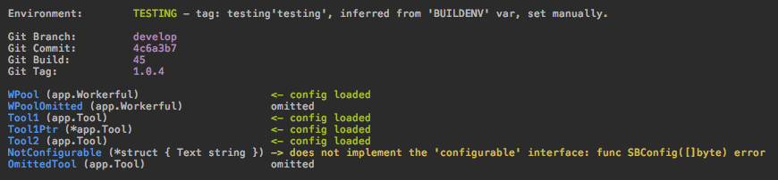

# SpareBox 


[](https://github.com/avelino/awesome-go)
[](https://travis-ci.org/oblq/sprbox)
[](https://codecov.io/gh/oblq/sprbox)
[](https://goreportcard.com/report/github.com/oblq/sprbox)
[](https://godoc.org/github.com/oblq/sprbox)
[](https://lbesson.mit-license.org/)


Dynamically create toolbox singletons with automatic configuration based on your build environment.  
SpareBox is an agnostic config parser (supporting YAML, TOML, JSON and Environment vars) and a toolbox factory that will help you in keeping your projects ordered and maintainable.

## Installation

```sh
go get -u github.com/oblq/sprbox
```

## Agnostic config unmarshaling

Given that project structure:
```
├── config
│   └── cfg.yaml
└── main.go
```

cfg.yaml:

```yaml
fromyaml: "this comes from yaml"
```

...to unmarshal that config file to a struct is simple like that:

```go
package main

import (
	"fmt"
	"os"
	
	"github.com/oblq/sprbox"
	"github.com/oblq/workerful"
)

type Config struct{
	FromEnv     string  `sprbox:"env=ASTRING"` // grab the value from the environment
	FromDefault string  `sprbox:"default=this comes from default,required"` // set the default value
	FromYaml    string  `sprbox:"required"` // error if not provided
} 

func main() {
	os.Setenv("ASTRING", "this comes from the environment")
	
	var myConfig Config	
	err := sprbox.LoadConfig(&myConfig, "./config/cfg.yaml")
	if err != nil {
		fmt.Println(err)
	}
	fmt.Printf("%#v\n", myConfig) 
	// Config{
	//      FromEnv:        "this comes from the environment", 
	//      FromDefault:    "this comes from default",
	//      FromYaml:       "this comes from yaml",
	// }
}
```

Depending on the [build environment](#the-build-environment), trying to load `./cfg.yml` will also load `./cfg.<environment>.yml` (eg.: `cfg.production.yml`) if found, the latest will override the universal one for the specific environment.  

The file extension in the file path can be omitted, since sprbox can load YAML, TOML and JSON files it will search for `cfg.*` using RegEx, the config file itself must have an extension.  

## ToolBox autoload (init and config)

##### 1. Define your toolbox.

Fields can be of any type, sprbox will init nil struct pointers and pass config files where needed (structs or struct pointers).  
To load a configuration file a struct must implement the [configurable](#using-your-package-in-sprbox) interface.  

```go
type MyToolBox struct {
    // By default sprbox will look for a config file named 
    // like the struct field (ATool.*, case sensitive).
    ATool Tool

    // Define the config file explicitly, extension can be omitted.
    // workerful.<environment>.yml will override workerful.yml
    // for the given env, if exist.
    WP *workerful.Workerful `sprbox:"workerful.yml"`

    // ...or you can skip auto-config and do it later manually.
    AnOmittedTool Tool `sprbox:"omit"`
}

var ToolBox MyToolBox
```

##### 2. Init and configure the toolbox in one line.  

You can optionally pass the config file name to look for in the toolbox struct tags and, as for the `LoadConfig()` func, also in `LoadToolBox()` `cfg.<environment>.*` file will override `cfg.*`:  

```go
// ./config is your config path
sprbox.LoadToolBox(&ToolBox, "./config")
```



## The build environment
 
The build environment is determined matching a ***tag*** against some RegEx, since any of the env's RegEx can be edited users have maximum flexibility on the method to use.  
For instance, the machine hostname (`cat /etc/hostname`) can be used for the ***tag***... you decide.

sprbox will try to grab that tag in three different ways, in a precise order, if one can't be determined it will check for the next one:

1. The `BUILDENV` var in sprbox package:
    ```go
    sprbox.BUILDENV = "dev"
    ```
    Since it is an exported string, can also be interpolated with `-ldflags` at build/run time:  
    ```bash
    LDFLAGS="-X ${GOPATH:-$HOME/go}/src/github.com/oblq/sprbox.BUILDENV=develop"
    go build -ldflags "${LDFLAGS}" -v -o ./api_bin ./api
    ```

2. The environment variable `'BUILD_ENV'`:
    ```go
    // sprbox.EnvVarKey is 'BUILD_ENV'
    os.Setenv(sprbox.EnvVarKey, "dev")
    ```

3. The Git branch name (Gitflow supported).  
By default the working dir is used, you can pass a different git repository path for this:  
    ```go
    sprbox.VCS = sprbox.NewRepository("path/to/repo")
    println(sprbox.VCS.BranchName) // Commit, Tag, Build, Path and Error
    sprbox.VCS.PrintInfo()
    ```  

Every environment has a set of default RegEx:

```
Production  = []string{"production", "master"}
Staging     = []string{"staging", "release/*", "hotfix/*"}
Testing     = []string{"testing", "test", "feature/*"}
Development = []string{"development", "develop", "dev"}
Local       = []string{"local"}
```

Editing is simple:

```go
sprbox.Testing.SetExps([]string{"testing", "test"})
sprbox.Testing.AppendExp("feature/f*")
println("matched:", sprbox.Testing.MatchTag("feature/f5"))
```  

Finally you can check the current env in code with:

```go
if sprbox.Env() == sprbox.Production { 
    doSomething() 
}
println(sprbox.Env().String())
sprbox.Env().PrintInfo()

sprbox.SubPathByEnv("static") // -> "static/<environment>"
```
 
## Using your package in sprbox

To start using your package in `sprbox` you just need to implement the `configurable` interface:

```go
type configurable interface {
	SBConfig([]byte) error
}
```

For instance:

```go
type MyPackage struct {
	Something string `yaml:"something"`
}

// SBConfig is the sprbox 'configurable' interface implementation.
// (mp *MyPackage) is automatically initialized with a pointer to MyPackage{}
// so it will never be nil, but needs configuration.
func (mp *MyPackage) SBConfig(configData []byte) (err error) {
	var config *MyPackageConfig
	err = sprbox.Unmarshal(configData, &config)
	mp.DoSomethingWithConfig(config)
	return
}
```

Add `sprbox` in your repo topics and/or the 'sprbox-ready' badge if you like it: [](https://github.com/oblq/sprbox)  


## Embed third-party packages in sprbox

Suppose we want to embed `packagex.StructX`:

```go
type StructX struct {
	*packagex.StructX
}

// since the config file format is known here
// you can use yaml, toml or json unmarshaler directly.
// anyway sprbox.Unmarshal() will recognize any of those formats
// allowing you to also use different config files format.
func (sx *StructX) SBConfig(configData []byte) (err error) {
	var cfg packagex.Config
	err = sprbox.Unmarshal(configData, &cfg)    	
	sx.StructX = packagex.NewStructX(cfg)
	return
}
```

From here on you can use the StructX in a toolbox with automatic init/config:

```go
type ToolBox struct {
	SX StructX
}

var App ToolBox

func init() {
	// ./config must contain SX.(.yml, .yaml, .json, .toml) config file
	sprbox.LoadToolBox(&App, "./config") 
	
	// call any of the packagex.StructX's funcs on SX
	// Initialized and configured.
	App.SX.DoSomething()
}
```
## Examples
- [example](example)

## Compatible packages

- [`workerful`](https://github.com/oblq/workerful) Full-featured worker-pool implementation.

## Author

- [Marco Muratori](mailto:marcomrtr@gmail.com) 

## License

Workerful is available under the MIT license. See the [LICENSE](./LICENSE) file for more information.
