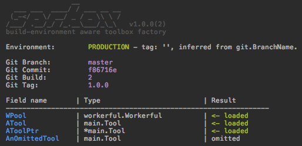

# SpareBox 

[](https://travis-ci.org/oblq/sprbox)
[](https://codecov.io/gh/oblq/sprbox)
[](https://goreportcard.com/report/github.com/oblq/sprbox)

[](https://godoc.org/github.com/oblq/sprbox)
[](https://lbesson.mit-license.org/)

**SpareBox** is a toolbox factory with automatic package configuration based on your build environment.

Given your toolbox struct, composed by compatible packages (see the `boxable` interface):  
```go
type MyToolBox struct {
	WPool workerful.Workerful `sprbox:"workerpool.yml"`

	// By default sprbox will look for a file named like the
	// struct field name (ATool.yml, case insensitive).
	ATool    Tool
	AToolPtr *Tool `sprbox:"atool.yml"`

	// ...or you can skip initialization and initialize it later by code
	AnOmittedTool Tool `sprbox:"omit"`
}

var ToolBox MyToolBox
```

...and a config path with a subfolder for every environment you plan to use:
    
    ├── MyConfigPath
    │   ├── development
    │   ├── local
    │   ├── production
    │   ├── staging
    │   └── testing
    └── main.go
     
You can init and configure it in one line of code:

```go
sprbox.InitAndConfig(&ToolBox, "path/to/config")
```

...and the result is:



See the example: [example](example)

## Install
```sh
go get -u github.com/oblq/sprbox
```

## Conforming your package

To start using your package in `sprbox` you just need to implement the `boxable` interface:

```go
type boxable interface {
	Go2Box(string) error
}
```

For instance:

```go
type MyPackage struct {
	Something string `yaml:"something"`
}

// Go2Box is the sprbox 'boxable' interface implementation.
func (mp *MyPackage) Go2Box(configPath string) error {
	if configFile, err := ioutil.ReadFile(configPath); err != nil {
		return fmt.Errorf("wrong config path: %s", err.Error())
	} else if err = yaml.Unmarshal(configFile, mp); err != nil {
		return fmt.Errorf("can't unmarshal config file: %s", err.Error())
	}
	return nil
}
```

Remember to add `sprbox` in your repo topics if you like it.

## How it works

SpareBox support the five standard build environment (local, testing, development, staging and production) and automatically select the right config file based on a tag, using RegEx to match it.

Every environment has a set of patterns and they can be edited:
```go
sprbox.Staging.SetExps([]string{"feature/f1", "feature/f2"})
sprbox.Testing.AppendExp("feature/f*")
match := sprbox.Testing.MatchTag("feature/f5")
```  
SpareBox can obtain the tag in three different ways, in a precise order, if one can't be determined it will check the next one:

1. The `BUILDENV` var in sprbox package (`sprbox.BUILDENV`).  
Can be defined by code or, since it is an exported string, can also be interpolated with `-ldflags` at build/run time:  
`LDFLAGS="-X ${GOPATH:-$HOME/go}/src/github.com/oblq/sprbox.BUILDENV=develop"`  
`go build -ldflags "${LDFLAGS}" -v -o ./api_bin ./api`

2. The environment variable `BUILD_ENV` (`os.GetEnv("BUILD_ENV")`).  

3. The branch name, Git Flow for CI/CD are supported.  
By default the working dir is used, you can pass a different git repository path for this:  
`sprbox.VCS = sprbox.NewRepository("path/to/repo")`  
Then the branch name will be checked against the RegEx patterns for any environment.

The default RegEx pattern are:  
- `Production 	[]string{"production", "master"}`
- `Staging 		[]string{"staging", "release/*", "hotfix/*"}`
- `Testing 	    []string{"testing", "test", "feature/*"}`
- `Development  []string{"development", "develop", "dev"}`
- `Local        []string{"local"}`
	
SpareBox will grab the correct config file, in the right directory, for the right environment.

Optionally you can:
- Manually set the environment:  
`sprbox.BUILDENV = "dev"`  
..also like this:  
`err := os.Setenv(sprbox.EnvVarKey, "dev")`


- Set a different repository path to automatically select config files based on branch name RegEx matching ...or to simply print git info in console:  
`sprbox.VCS = sprbox.NewRepository("path/to/repo")`  
`sprbox.VCS.BranchName // Commit, Tag, Build and Path`  
`sprbox.VCS.PrintInfo()`

- Print info in console:  
`sprbox.PrintInfo(false)`

- Get the current environment:  
`if sprbox.Env() == sprbox.Production { doSomething() }`  
`sprbox.Env().String()`  
`sprbox.Env().PrintInfo()`

- Get the SpareBox path and/or the sub-path for the current build environment and also use it for any kind of static file related to a specific build environment.  
`sprbox.SubPathByEnv("path") // -> "path/<environment>"`

## Compatible tools

- [`workerful`](https://github.com/oblq/workerful) Full-featured worker-pool implementation.

## Author

- [Marco Muratori](mailto:marcomrtr@gmail.com) 

## License

Workerful is available under the MIT license. See the [LICENSE](./LICENSE) file for more information.
