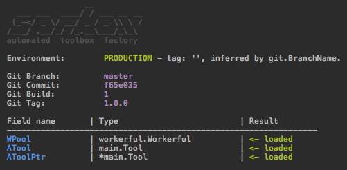

# SpareBox 
[](https://godoc.org/github.com/oblq/sprbox)

**Sparebox** (written 'sprbox') is a toolbox factory with automatic package configuration based on your build environment.

Given a predefined struct:
```
type MyToolBox struct {
	WPool       workerful.Workerful
	ATool       Tool 
	AToolPtr    *Tool
}
```
...you can init and configure it in one line of code:

```
var ToolBox MyToolBox

sprbox.InitAndConfig(&ToolBox, "path/to/config")
```
...and the result is:




See the example: [example](example/)

## Conforming your package

Start using your package in `sprbox` is simple, you just have to implement the `boxable` interface to automatically parse the config file:

```go
type boxable interface {
	Go2Box(string) error
}
```

For instance:

```go
type MyPackage struct {
	something string `yaml:"something"`
}

// Go2Box is the sprbox 'boxable' interface implementation.
func (mp *MyPackage) Go2Box(configPath string) error {
	if configFile, err := ioutil.ReadFile(configPath); err != nil {
		return fmt.Errorf("wrong config path: %s", err.Error())
	} else if err = yaml.Unmarshal(configFile, mp); err != nil {
		return fmt.Errorf("can't unmarshal config file: %s", err.Error())
	}
	return nil
}
```

Remember to add `sprbox` in your repo topics if you like it.

## Install
```sh
go get -u github.com/oblq/sprbox
```

## How it works

Sparebox support the five standard build environment (local, testing, development, staging and production) and automatically select the right config file based on a tag, using RegEx expressions to match it.

Every environment has a set of patterns and they can be edited:
```
sprbox.Development.SetExps([]string{"feature/f1", "feature/f2"})
sprbox.Development.AppendExp("feature/f*")
match := sprbox.Development.MatchTag("feature/f5")
```  
The tag can be obtained in three different ways, in a precise order, if one can't be determined SpareBox will check the next one:

1. The `BUILDENV` var in sprbox package (`sprbox.BUILDENV`).  
Can be defined by code or, since it is an exported string, can also be interpolated with `-ldflags` at build/run time:  
`LDFLAGS="-X ${GOPATH:-$HOME/go}/src/github.com/oblq/sprbox.BUILDENV=develop"`  
  `go build -ldflags "${LDFLAGS}" -v -o ./api_bin ./api`

2. The environment variable `BUILD_ENV` (`os.GetEnv("BUILD_ENV")`).  
3. The branch name, Git Flow is supported.  
You must pass the git repository path for this:  
`sprbox.VCS = sprbox.NewRepository("path/to/repo")`  
Then the branch name will be checked against the RegEx patterns for any environment.

The default RegEx pattern are:  
- `Production 	[]string{"production", "master"}`
- `Staging 		[]string{"staging", "release/\*", "hotfix/\*"}`
- `Testing 	    []string{"testing", "test", "feature/\*"}`
- `Development  []string{"development", "develop", "dev"}`
- `Local        []string{"local"}`
	
The project must contain a config path with a subfolder for every environment you plan to use:
    
    ├── MyConfigPath
    │   ├── development
    │   ├── local
    │   ├── production
    │   ├── staging
    │   └── testing
    └── main.go
        
...then sparebox will grab the correct config file, in the right directory, for the right environment, it also supports tags:
```go
type MyToolBox struct {
	// by default sprbox will look for 'WPool.yml' (case insensitive) in the config path.
	WPool           workerful.Workerful 
	
	// ...or you can define a custom config file.
 	ATool           Tool    `sprbox:"atool1.yml"`  
	AToolPtr        *Tool   `sprbox:"atool2.yml"`
	
	// ...or you can skip initialization and initialize it later by code.
	AToolOmitted    *Tool   `sprbox:"omit"`
}

var ToolBox MyToolBox

sprbox.VCS = sprbox.NewRepository("./")
sprbox.PrintInfo(false) // Print some useful info.
sprbox.InitAndConfig(&ToolBox, "./MyConfigPath")
```       