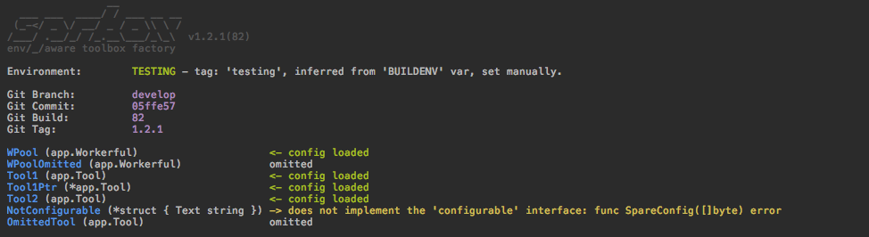

# SpareBox 

[](https://github.com/avelino/awesome-go)

[](https://travis-ci.org/oblq/sprbox)
[](https://codecov.io/gh/oblq/sprbox)
[](https://goreportcard.com/report/github.com/oblq/sprbox)
[](https://godoc.org/github.com/oblq/sprbox)
[](https://lbesson.mit-license.org/)


Dynamically create toolbox singletons with automatic configuration based on your build environment.  
SpareBox is also an agnostic, layered, config parser (supporting YAML, TOML, JSON and Environment vars), it will help you in keeping your projects and their configuration files ordered and maintainable.

## Installation

```sh
go get -u github.com/oblq/sprbox
```

## Agnostic, layered, config unmarshaling

Given that project structure:
```
├── config
│   ├── pg.yaml
│   └── pg.production.yaml
└── main.go
```

pg.yaml:

```yaml
port: 2222
```

pg.production.yaml:

```yaml
port: 2345
```

...to unmarshal that config files to a struct is simple like that:

```go
package main

import (
	"fmt"
	"os"
	
	"github.com/oblq/sprbox"
)

type PostgresConfig struct{
	// Environment vars overrides both default values and config file provided values.
	DB       string `sprbox:"env=POSTGRES_DB,default=postgres"`
	User     string `sprbox:"env=POSTGRES_USER,default=postgres"`
	// If no value is found that will return an error: 'required'.
	Password string `sprbox:"env=POSTGRES_PASSWORD,required"`
	Port     int    `sprbox:"default=5432"`
} 

func main() {
	os.Setenv("POSTGRES_PASSWORD", "123_only_known_by_me")
	
	// Setting 'production' build-environment,
	// so 'pg.production.yml' will override 'pg.yml'.
	sprbox.BUILDENV = sprbox.Production.String() // -> 'production'
	
	var pgConfig PostgresConfig	
	if err := sprbox.LoadConfig(&pgConfig, "config/pg.yaml"); err != nil {
		fmt.Println(err)
	}
	
	fmt.Printf("%#v\n", pgConfig) 
	// Config{
	//      DB:         "postgres"
	//      User:       "postgres"
	//      Password:   "123_only_known_by_me"
	//      Port:       2345
	// }
}
```

Depending on the [build environment](#the-build-environment), trying to load `config/pg.yml` will also load `config/pg.<environment>.yml` (eg.: `cfg.production.yml`).  
If any environment-specific file will be found, for the current environment, that will override the universal one.  

It is possible to load multiple separated config files, also of different type, so components configs can be reused:

```go
func main() {
	// File extension can be omitted:
	var pusher PushNotifications	
	sprbox.LoadConfig(&pusher, "config/pusher", "config/pg")
}
```

The file extension in the file path can be omitted, since sprbox can load YAML, TOML and JSON files it will search for `cfg.*` using RegEx, the config file itself must have an extension.  

To read the configuration at runtime sprbox can load multiple config files on a map, anyway keep in mind that:
1. YAML files use lowercased keys by default, unless you define a custom field tag (struct field `Postgres` will become `"postgres"`, while in TOML or JSON it will remain `"Postgres"`).
2. Embedded structs will be decoded as `map[interface{}]interface{}` in YAML, not `map[string]interface{}` as in JSON or TOML.

```go
mergedConfigMap, err := sprbox.LoadConfigMap("config/cfg1.yml", "config/cfg2.toml", "config/cfg3.json")
```

## ToolBox autoload (init and config)

##### 1. Define your toolbox.

Fields can be of any type, sprbox will init nil struct pointers and pass config files where needed (structs or struct pointers).  
To load a configuration file a struct must implement the [configurable](#using-your-package-in-sprbox) interface.  

```go
type MyToolBox struct {
    // By default sprbox will look for a config file named 
    // like the struct field (Pusher.*, case sensitive).
    Pusher PushNotifications
    
    // You can define one or more specific config file(s), 
    // separated by the pipe symbol: |.
    // The latest will overrides others, from right to left,
    // you can see that using sprbox.SetDebug(true).
    // sprbox will always try to find the file named
    // like the struct field first (Pusher2.*).
    // File extension can be omitted.
    Pusher2 PushNotifications `sprbox:"pusher|postgres"`

    // workerful.<environment>.yml will override workerful.yml
    // for the given env, if exist.
    WP *workerful.Workerful `sprbox:"workerful.yml"`

    // ...or you can skip auto-config and do it later manually.
    AnOmittedTool Tool `sprbox:"omit"`
}

var ToolBox MyToolBox
```

##### 2. Init and configure the toolbox in one line.  

As for the `sprbox.LoadConfig()` func, also in `sprbox.LoadToolBox()` environment-specific config files (`cfg.<environment>.*`) will override the universal one (`cfg.*`):  

```go
// sprbox.SetDebug(true) // optionally set debug mode
sprbox.LoadToolBox(&ToolBox, "./config")
```



## The build environment
 
The build environment is determined matching a ***tag*** against some predefined environment specific RegEx, since any of the env's RegEx can be edited users have the maximum flexibility on the method to use.  
For instance, the machine hostname (`cat /etc/hostname`) can be used.

sprbox will try to grab that tag in three different ways, in a precise order, if one can't be determined it will check for the next one:

1. The `BUILDENV` var in sprbox package:
    ```go
    sprbox.BUILDENV = "dev"
    ```
    Since it is an exported string, can also be interpolated with `-ldflags` at build/run time:  
    ```bash
    LDFLAGS="-X ${GOPATH:-$HOME/go}/src/github.com/oblq/sprbox.BUILDENV=develop"
    go build -ldflags "${LDFLAGS}" -v -o ./api_bin ./api
    ```

2. The environment variable `'BUILD_ENV'`:
    ```go
    // sprbox.EnvVarKey is 'BUILD_ENV'
    os.Setenv(sprbox.EnvVarKey, "dev")
    ```

3. The Git branch name (Gitflow supported).  
By default the working dir is used, you can pass a different git repository path for this:  
    ```go
    sprbox.VCS = sprbox.NewRepository("path/to/repo")
    println(sprbox.VCS.BranchName) // Commit, Tag, Build, Path and Error
    sprbox.VCS.PrintInfo()
    ```  

Every environment has a set of default RegEx:

```
Production  = []string{"production", "master"}
Staging     = []string{"staging", "release/*", "hotfix/*"}
Testing     = []string{"testing", "test", "feature/*"}
Development = []string{"development", "develop", "dev"}
Local       = []string{"local"}
```

Editing is simple:

```go
sprbox.Testing.SetExps([]string{"testing", "test"})
sprbox.Testing.AppendExp("feature/f*")
println("matched:", sprbox.Testing.MatchTag("feature/f5"))
```  

Finally you can check the current env in code with:

```go
if sprbox.Env() == sprbox.Production { 
    doSomething() 
}

sprbox.Env().PrintInfo()

sprbox.EnvSubDir("static") // -> "static/<environment>"
```
 
## Using your package in sprbox

To start using your package in `sprbox` you just need to implement the `configurable` interface:

```go
type configurable interface {
	SpareConfig([]byte) error
}
```

Example:

```go
type MyPackage struct {
	Something string `yaml:"something"`
}

// SpareConfig is the sprbox 'configurable' interface implementation.
// (mp *MyPackage) is automatically initialized with a pointer to MyPackage{}
// so it will never be nil, but needs configuration.
func (mp *MyPackage) SpareConfig(configData []byte) (err error) {
	var config *MyPackageConfig
	err = sprbox.Unmarshal(configData, &config)
	mp.DoSomethingWithConfig(config)
	return
}
```

Add `sprbox` in your repo topics and/or the 'sprbox-ready' badge if you like it: [](https://github.com/oblq/sprbox)  


## Embed third-party packages in sprbox

Suppose we want to embed `packagex.StructX`:

```go
type StructX struct {
	*packagex.StructX
}

// Since the config file format is known here
// you can use yaml, toml or json unmarshaler directly.
// Anyway sprbox.Unmarshal() will recognize any of those formats,
// allowing you to also use different config files format.
func (sx *StructX) SpareConfig(configData []byte) (err error) {
	var cfg packagex.Config
	err = sprbox.Unmarshal(configData, &cfg)    	
	sx.StructX = packagex.NewStructX(cfg)
	return
}
```

From here on you can use the StructX in a toolbox with automatic init/config:

```go
type ToolBox struct {
	SX StructX
}

var App ToolBox

func init() {
	// ./config must contain SX.(yml|yaml|json|toml) config file in that case.
	sprbox.LoadToolBox(&App, "./config") 
	
	// Call any of the packagex.StructX's funcs on SX.
	// Initialized and configured.
	App.SX.DoSomething()
}
```
## Examples
- [example](example)

## Compatible packages

- [`workerful`](https://github.com/oblq/workerful) Full-featured worker-pool implementation.

## Used packages

- [`gopkg.in/yaml.v2`](https://github.com/go-yaml/yaml)  
- [`github.com/BurntSushi/toml`](https://github.com/BurntSushi/toml)

## Author

- [Marco Muratori](mailto:marcomrtr@gmail.com) 

## License

Workerful is available under the MIT license. See the [LICENSE](./LICENSE) file for more information.
